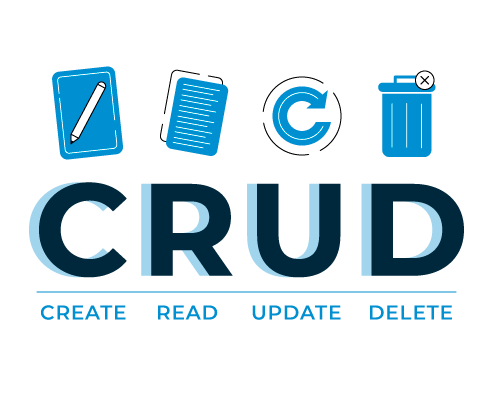

# CRUD con Python

Pequeño programa en Python que realiza CRUD (Create, Read, Update, Delete) de un archivo CSV.

> Más adelante modificaré el código para mejorarlo.

---
⌨️ por [Malalo](https://github.com/m4lal0)